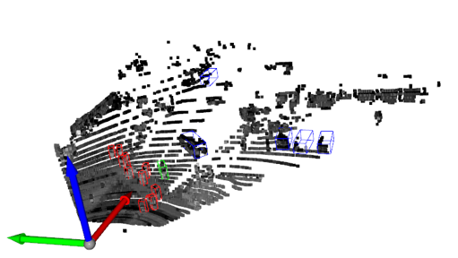
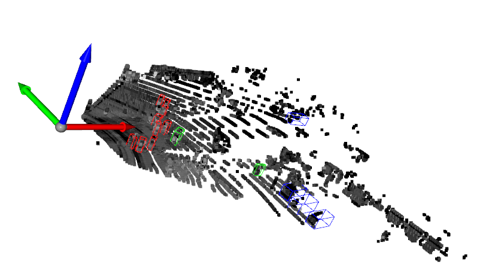
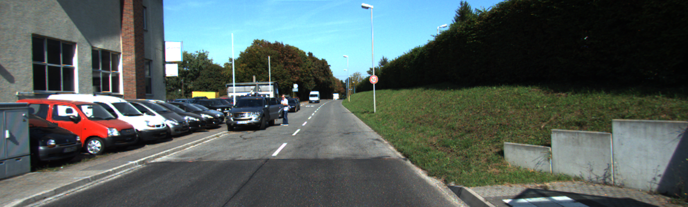
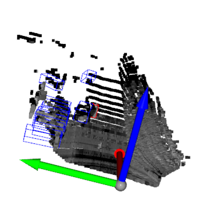
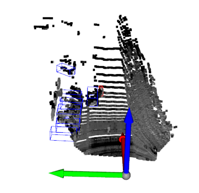

# PointPillars-IntraAttention

An enhanced implementation of the [PointPillars](https://arxiv.org/abs/1812.05784) object detection network, featuring **intra-pillar attention mechanisms** for improved feature learning within each pillar.

Built on top of the excellent [PointPillars](https://github.com/zhulf0804/PointPillars) implementation by [@zhulf0804](https://github.com/zhulf0804).

##  Overview

This project explores the integration of attention mechanisms **within pillars** in the PointPillars architecture to better capture intra-pillar point relationships. 
The goal is to improve object detection performance on 3D point cloud datasets like **KITTI**, especially for smaller or harder-to-detect objects.
Utilizes **non-scaled dot-product attention**, allowing points within a pillar to be "aware" of global (within-pillar) context.
Note: The self-attention block operates **before the max-pooling step** in each pillar.
The attention module can be found in model/attention.py

I have also modified the original train.py script to allow for training with multiple GPUs.
Default batch size is 6, it is recommended to increase this if you use multiple GPUs

## mAP on KITTI validation set (Easy, Moderate, Hard)

Improvemed metrics are bolded.

| Repo | Metric | Overall | Pedestrian | Cyclist | Car |
| :---: | :---: | :---: | :---: | :---: | :---: |
| this repo | 3D-BBox | 70.9864, 60.2501, 57.4482 | 47.6624, 43.2129, 40.4149 | 80.3744, 61.1289, 58.4645 | 84.9223, 76.4804, 73.4561 | 
| [PointPillars](https://github.com/zhulf0804/PointPillars) | 3D-BBox  | 73.3259, 62.7834, 59.6278 | 51.4642, 47.9446, 43.8040 | 81.8677, 63.6617, 60.9126 | 86.6456, 76.7439, 74.1668 |
| this repo | BEV | 76.6065, 68.7468, 65.4959 | 58.2735, 53.7279, 49.8899 | 81.6864, 65.9320, 61.5786 | 89.8597, 86.5804, 85.0191 |  
| [PointPillars](https://github.com/zhulf0804/PointPillars) | BEV | 77.8540, 69.8003, 66.6699 | 59.1687, 54.3456, 50.5023 | 84.4268, 67.1409, 63.7409 | 89.9664, 87.9145, 85.7664 |
| this repo | 2D-BBox | **80.7326, 75.7972, 72,072** | 64.3336, 62.0636, 57.7244 | **87.2175, 76.0856, 72.1765** | 90.6468, 89.2423, 86.3097 |
| [PointPillars](https://github.com/zhulf0804/PointPillars) | 2D-BBox | 80.5097, 74.6120, 71.4758 | 64.6249, 61.4201, 57.5965 | 86.2569, 73.0828, 70.1726 | 90.6471, 89.3330, 86.6583 |
| this repo | AOS | **75.6254, 70.3491, 66.9054** | **49.3698, 47.9208, 44.6814** | **86.9134, 74.2810, 70.3554** | **90.5930, 88.8454**, 85.6793 |
| [PointPillars](https://github.com/zhulf0804/PointPillars) | AOS | 74.9647, 68.1712, 65.2817 | 49.2763, 46.7284, 43.8352 | 85.0412, 69.1024, 66.2801 | 90.4752, 88.6828, 85.7298 |

## Detection Visualization

**Scene 1208**


this repo


[PointPillars](https://github.com/zhulf0804/PointPillars)


**Scene 40**


this repo


[PointPillars](https://github.com/zhulf0804/PointPillars)


## Install
1. Clone the repository:
   ```
   git clone https://github.com/griff-p/PointPillars-IntraAttention.git
   cd PointPillars-IntraAttention
   ```
2. Install requirements
   ```
   pip install -r requirements.txt
   ```
3. Compile
   ```
   cd ops
   python setup.py develop
   ```

## Datasets

1. Download

    Download [point cloud](https://s3.eu-central-1.amazonaws.com/avg-kitti/data_object_velodyne.zip)(29GB), [images](https://s3.eu-central-1.amazonaws.com/avg-kitti/data_object_image_2.zip)(12 GB), [calibration files](https://s3.eu-central-1.amazonaws.com/avg-kitti/data_object_calib.zip)(16 MB)和[labels](https://s3.eu-central-1.amazonaws.com/avg-kitti/data_object_label_2.zip)(5 MB)。Format the datasets as follows:
    ```
    kitti
        |- training
            |- calib (#7481 .txt)
            |- image_2 (#7481 .png)
            |- label_2 (#7481 .txt)
            |- velodyne (#7481 .bin)
        |- testing
            |- calib (#7518 .txt)
            |- image_2 (#7518 .png)
            |- velodyne (#7518 .bin)
    ```

2. Pre-process KITTI datasets First

    ```
    cd PointPillars/
    python pre_process_kitti.py --data_root your_path_to_kitti
    ```

    Now, we have datasets as follows:
    ```
    kitti
        |- training
            |- calib (#7481 .txt)
            |- image_2 (#7481 .png)
            |- label_2 (#7481 .txt)
            |- velodyne (#7481 .bin)
            |- velodyne_reduced (#7481 .bin)
        |- testing
            |- calib (#7518 .txt)
            |- image_2 (#7518 .png)
            |- velodyne (#7518 .bin)
            |- velodyne_reduced (#7518 .bin)
        |- kitti_gt_database (# 19700 .bin)
        |- kitti_infos_train.pkl
        |- kitti_infos_val.pkl
        |- kitti_infos_trainval.pkl
        |- kitti_infos_test.pkl
        |- kitti_dbinfos_train.pkl
    ```

Note: I've left in the original non-attention python scripts for my own reference, make sure you use the correct _attention.py script.
## Training

```
cd PointPillars/
python train_attention.py --data_root your_path_to_kitti
```

## Evaluation

```
cd PointPillars/
python evaluate_attention.py --ckpt pretrained/epoch_attention_140.pth --data_root your_path_to_kitti 
```

## Test

```
cd PointPillars/

 1. infer and visualize point cloud detection
python test_attention.py --ckpt pretrained/epoch_attention_140.pth --pc_path your_pc_path 

 2. infer and visualize point cloud detection and gound truth.
python test_attention.py --ckpt pretrained/epoch_attention_140.pth --pc_path your_pc_path --calib_path your_calib_path  --gt_path your_gt_path

 3. infer and visualize point cloud & image detection
python test_attention.py --ckpt pretrained/epoch_attention_140.pth --pc_path your_pc_path --calib_path your_calib_path --img_path your_img_path


e.g. 
[infer on val set 000134]

python test_attention.py --ckpt pretrained/epoch_attention_140.pth --pc_path pointpillars/dataset/demo_data/val/000134.bin

or

python test_attention.py --ckpt pretrained/epoch_attention_140.pth --pc_path pointpillars/dataset/demo_data/val/000134.bin \
               --calib_path pointpillars/dataset/demo_data/val/000134.txt \
               --img_path pointpillars/dataset/demo_data/val/000134.png \
               --gt_path pointpillars/dataset/demo_data/val/000134_gt.txt
```

## Acknowledgements
Thanks for the open source code [@zhulf0804](https://github.com/zhulf0804)

KITTI dataset providied by Karlsruhe Institute of Technology and Toyota Technological Institute at Chicago
